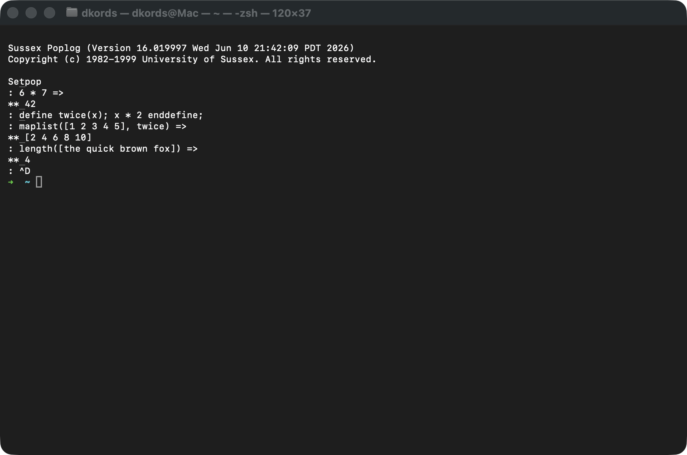
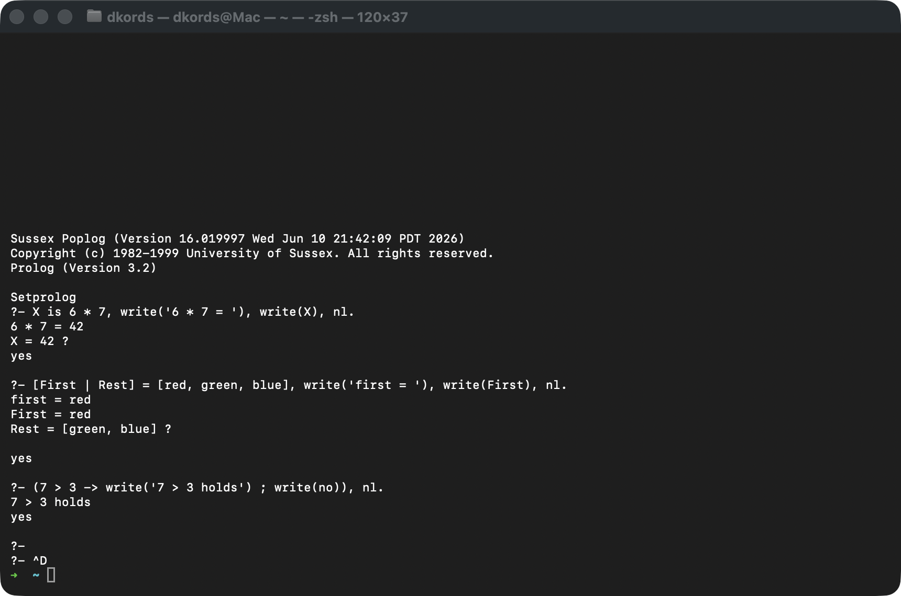
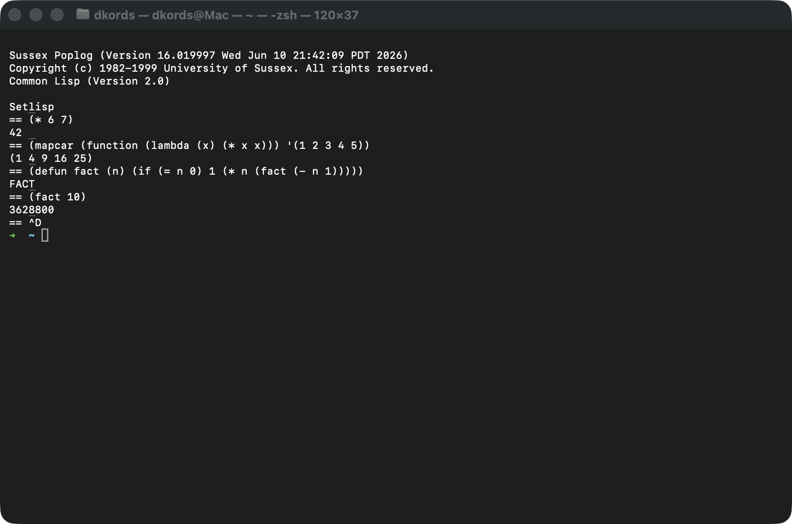
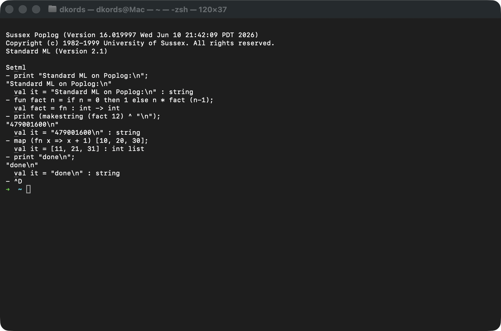
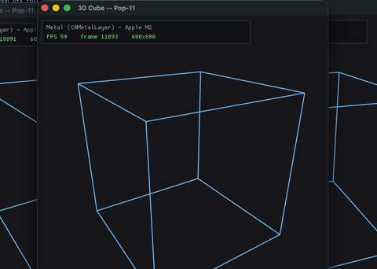
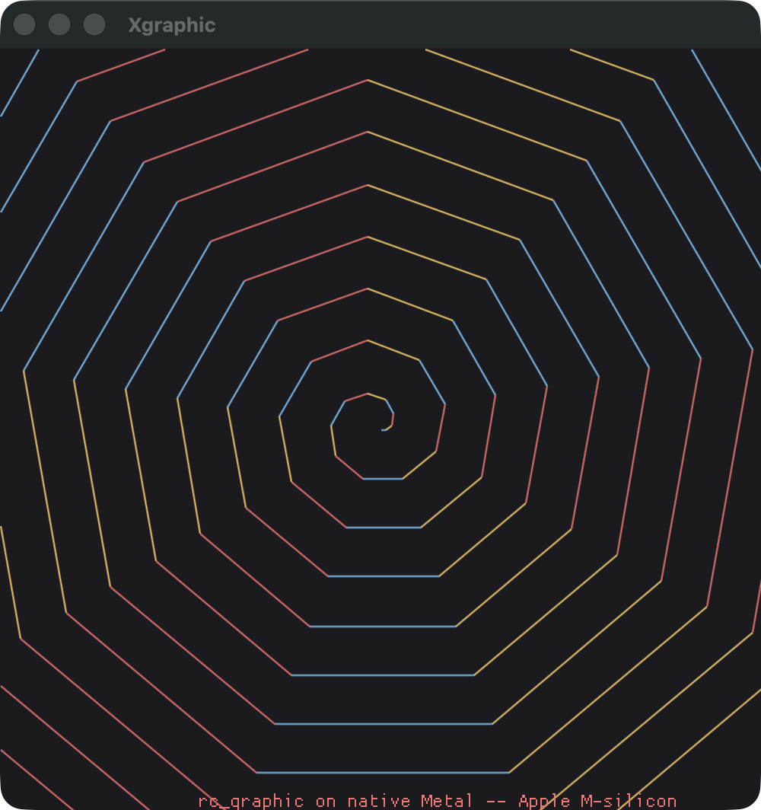
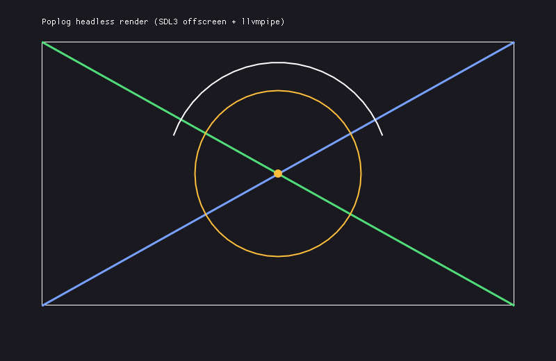
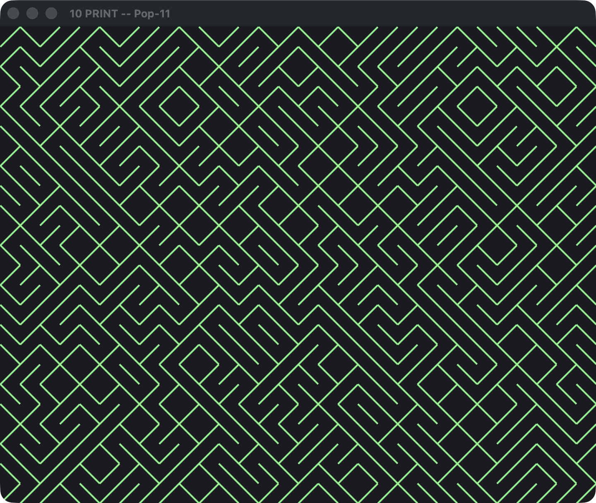
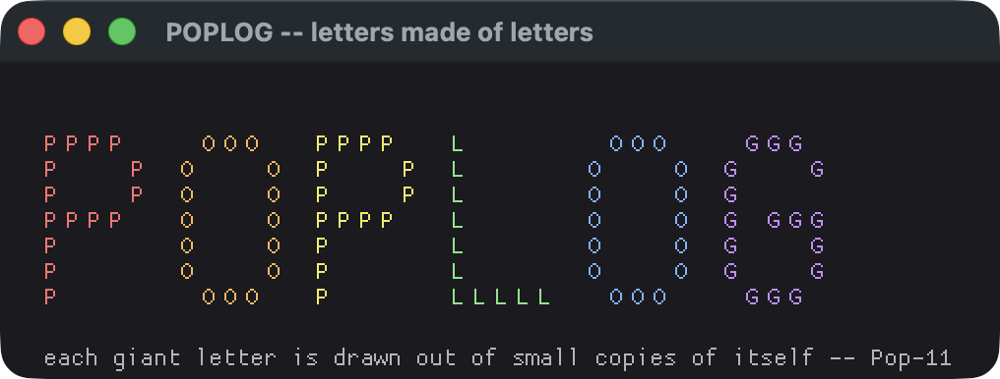

POPLOG is a free, open source, multi-language software development
environment providing incremental compilers for a number of interactive
programming languages, notably:

* Pop-11
    The core language of Poplog, including a rich interface to the X
    window system and a powerful Object Oriented programming extension,
    Objectclass, developed by Steve Leach now a standard part of the
    language (comparable to CLOS as an extension of LISP). 
* Prolog
    Standard prolog with the "Edinburgh" syntax.
* Common Lisp
    Compatible with most of CLTL2 (Common Lisp the language, 2nd
    Edition) by G.L. Steele
* Standard ML
    A powerful, strongly typed, polymorphic, functional language.

Poplog provides support for multi-paradigm software development in a
rapid prototyping environment, because of the use of (fast) incremental
compilers for all the languages.  There is substantial AI and teaching
material using Poplog, some included in this repository, some
in separate packages repository, some available on the net.

---

## The four languages, live

All four incremental compilers share one virtual machine and one saved image,
and interoperate freely.  Captured from the Apple Silicon (macOS) build:

| Pop-11 — the core language | Prolog — Edinburgh syntax |
| :---: | :---: |
|  |  |
| **Common Lisp — CLTL2** | **Standard ML — type inference** |
|  |  |

## Forth — a fifth language (new in this fork)

The four languages above are classic Poplog.  This fork adds a fifth,
**Forth**, as a first-class Poplog subsystem.  The design leans on Poplog's
open-stack calling convention so the implementation stays small and the result
is genuinely native:

* **Forth's data stack *is* the Poplog user stack**, so Forth primitives are
  ordinary open-stack Pop-11 procedures (`+` is `define f_plus(x,y); x+y
  enddefine`).
* **Colon definitions compile to machine code.**  `: name … ;` transpiles to a
  Pop-11 procedure and is run through Poplog's incremental compiler, so a Forth
  word is a real native procedure — not threaded/interpreted code.  Control
  words (`if/else/then`, `begin/until`, `begin/while/repeat`, `do/loop`,
  `recurse`, `exit`) map onto Pop-11 constructs at compile time.
* **A first-class subsystem:** `.fth` is a recognised file type and `uses
  forth;` enters the REPL, alongside `pop11`/`lisp`/`prolog`/`ml`; `bye` or
  `pop11` returns to Pop-11.

```
$ tools/forth.sh                 # interactive REPL  (-t testbench, -b bench, -c '…')
forth> : sq  dup * ;
forth> 9 sq .
81  ok
forth> : fib  dup 2 < if drop 1 else dup 1 - recurse swap 2 - recurse + then ;
forth> 10 fib .
89  ok
```

The current core covers arithmetic, ~40 stack/compare/bitwise/IO words, native
colon definitions, the control words above, counted loops (`do/loop/i/j/leave`),
`variable`/`constant`/`@`/`!`, a return stack (`>r r@ r>`), and string literals.
It is newer and leaner than the four mature languages (no `+loop` /
`create does>` / `value` yet; case-sensitive).  Because it is pure Pop-11 it
runs on **every platform Poplog does**; the built-in `testbench` is **21/21** on
macOS arm64 and on RISC-V (StarFive VisionFive).  Implementation:
`pop/forth/src/forth.p`; examples in `pop/forth/examples/`; performance in
[BENCHMARKS.md](BENCHMARKS.md#forth).

## Platforms

Poplog builds and runs natively on a growing set of platforms
(status as of June 2026):

| OS | Architecture | Status | Notes |
| --- | --- | --- | --- |
| **Linux** | x86-64 | ✅ Supported | Reference platform |
| **Linux** | AArch64 (ARM64) | ✅ Supported | Validated on Raspberry Pi 5 — all four languages + saved images.  Generic `armv8-a`, no core-specific tuning, so it ports readily to other ARM64 boards (MediaTek Genio, Qualcomm Snapdragon) |
| **macOS** | Apple Silicon (arm64) | ✅ Supported | Native Mach-O port — self-hosting, all four languages, terminal VED, C↔Pop callbacks, and native graphics |
| **Linux** | ARM32 (`armv6`/`armv7`) | ✅ Supported | Long-standing 32-bit ARM port (`pop/src/syscomp/arm`); Raspberry Pi 1–3 and other 32-bit ARM Linux.  Not benchmarked in this report |
| **Solaris** | x86 (i386) | ✅ Supported | Upstream port (W. Hebisch); tested on Solaris 10 (`CC=gcc`, vendored `corepop_solaris.i386`).  Not benchmarked here |
| **FreeBSD** | x86-64 | ✅ Supported | Upstream port (W. Hebisch); tested on x86-64.  Not benchmarked here |
| **Linux** | RISC-V (`riscv64`, RV64GC) | ✅ Supported | Native RV64GC/LP64D port, self-hosting on a **StarFive VisionFive** (dual SiFive U74) — all four languages, saved images, terminal VED, and the FFI float ABI.  `tools/validate-riscv64.sh` = 14/14.  See `PORTING-RISCV64-LINUX.md` |
| **Windows** | x86-64 | 🚧 TODO | Not yet ported (WSL2 runs the Linux build as an interim) |

"Supported" means it builds and runs.  The first three rows plus RISC-V are
validated *and* benchmarked in this fork; ARM32, Solaris/x86 and FreeBSD/x86-64
are existing Poplog ports (ARM32 long-standing; Solaris + FreeBSD recent upstream
additions by W. Hebisch) that simply haven't been re-tested or benchmarked here.
The one remaining 🚧 row (Windows) is genuinely not yet ported.  See the
[platform-coverage table in BENCHMARKS.md](BENCHMARKS.md#platform-coverage).

Per-platform porting notes: `PORTING-ARM64-LINUX-RPI5.md` and
`PORTING-ARM64-M-SILICON-OSX.md`.

## Packaging (Nix)

A self-contained **Nix flake** builds and bootstraps the whole system — all
four languages and their saved images — from source, with no manual seed or
toolchain setup.  Tested end-to-end on `x86_64-linux` and `aarch64-darwin`;
`aarch64-linux` ships a vendored seed.

```sh
nix build .#poplog          # build; then ./result/bin/{pop11,clisp,prolog,pml,ved}
nix run   .#pop11           # run a REPL directly (or .#prolog / .#clisp / .#pml)
nix shell .#poplog          # drop all five front-ends onto $PATH
nix develop                 # dev shell for hacking on Poplog sources
nix build .#poplog-gfx      # experimental graphics: Metal on macOS, SDL3+OpenGL3 on Linux
```

The flake exposes `packages`, `apps`, and a `devShell` for every supported
system.  On macOS the build is signed ad-hoc with **no entitlements required**.

**First-build cost:** Nix builds the whole toolchain closure from source, so
the first build pulls **~1.1 GB** of cached dependencies and lands a **~1.2 GiB**
on-disk closure (the Poplog out-path is ~95 MB; the rest is shared deps), taking
a couple of minutes to build.  Subsequent builds of the same source fetch
nothing.  Full details — use cases, costs, the bootstrap-seed story, and the
graphics variant — are in **[`nix/README.md`](nix/README.md)**.

## Native graphics (experimental)

Historically Poplog's graphics were tied to the X window system (Xpw / `xved`).
There is now an **optional native graphics backend** built on
[Dear ImGui](https://github.com/ocornut/imgui), selected at build time with
`./configure --experimental-graphics` (it implies "no X"):

* **Metal + Cocoa** (macOS) — a native window with no X server or XQuartz.
* **SDL3 + OpenGL3** (macOS *or* Linux/Unix) — SDL3 selects the display
  transport at run time — **Wayland**, X11, or KMS/DRM — so there is **no hard
  X11 dependency**; it also renders **headless** via Mesa software (llvmpipe)
  for CI.

The **backend is chosen at build time**, so you can pick one and explore:

```sh
./configure --experimental-graphics          # per-OS default: Metal on macOS, SDL elsewhere
./configure --experimental-graphics=metal     # force Metal  (macOS only)
./configure --experimental-graphics=sdl       # force SDL3 + OpenGL (macOS or Linux)
```

`=sdl` needs SDL3 (`pkg-config sdl3` — e.g. `brew install sdl3`; or point at a
build with `SDL3_CFLAGS=… SDL3_LIBS=… ./configure --experimental-graphics=sdl`).
The running backend (and GPU) is reported by `gfx_spec()`; see the badge below.

The macOS **Metal** backend, live — `examples/cube3d.p`, a smooth vsync-paced
spin with an on-screen stats badge (backend, GPU, live FPS):



The classic `rc_graphic` turtle library and `rc_mouse` are ported onto it, so
existing Pop-11 graphics code runs unchanged.  Graphics are strictly **opt-in**:
the default build (and `nix build .#poplog`) is console-only.

| `rc_graphic` turtle on macOS (Metal) | Headless render on Linux (SDL3 + llvmpipe, no display) |
| :---: | :---: |
|  |  |

The right-hand image was rendered on Linux with **no display, GPU, or
compositor** (`tools/validate-gfx-headless.sh`) — the reproducible CI gate for
the graphics stack.

A few runnable demos live in [`examples/`](examples/) (`pop11
examples/tenprint.p` on a graphics build) — for instance the classic
[10 PRINT](https://10print.org/) maze and "POPLOG" drawn out of small letters:

| `examples/tenprint.p` | `examples/poplog_letters.p` |
| :---: | :---: |
|  |  |

## Performance

Poplog's incremental compilers emit fast native code on every backend.  For
cross-platform and cross-language benchmark numbers (x86-64, Apple M-series,
Raspberry Pi 5, with Python and Perl baselines for context), see
**[BENCHMARKS.md](BENCHMARKS.md)**.

---

This is cleaned up version of Poplog sources, currently only
core part.  It misses binary needed for bootstrap and extensions
(packages).  Packages are in separate repository:

  https://github.com/hebisch/poplog_packages

Bootstrap (`corepop`) binaries for the platforms ported here — x86-64
Linux, AArch64 Linux, Apple Silicon macOS, and RISC-V RV64GC Linux — are
published with checksums on this repository's releases page:

  https://github.com/IoTone/poplog/releases

(e.g. `releases/latest/download/corepop-aarch64-linux`; the same seeds
are vendored under `nix/seeds/` for the Nix flake build).  For the older
upstream platforms you can find bootstrap binaries at:

  https://poplog.fricas.org/corepops

There is buildable tarball for Intel/AMD 64-bit Linux at

  http://fricas.org/~hebisch/poplog

(this build version does not include newest changes to repository).

The **AArch64 Linux** port (see the Platforms table above) is written to the
generic `armv8-a` baseline and flushes the instruction cache via
`__clear_cache`, so it ports readily to other ARM64 boards -- the main
platform-specific knob is the kernel **page size** (saved images are
page-aligned; the Pi 5 uses 16 KB pages).  See `PORTING-ARM64-LINUX-RPI5.md`
(and its "Portability to other AArch64 platforms" section) for details.

For more detailed installation instructions see INSTALL.
