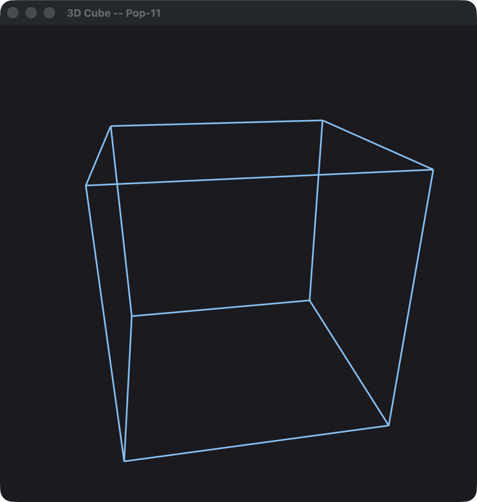
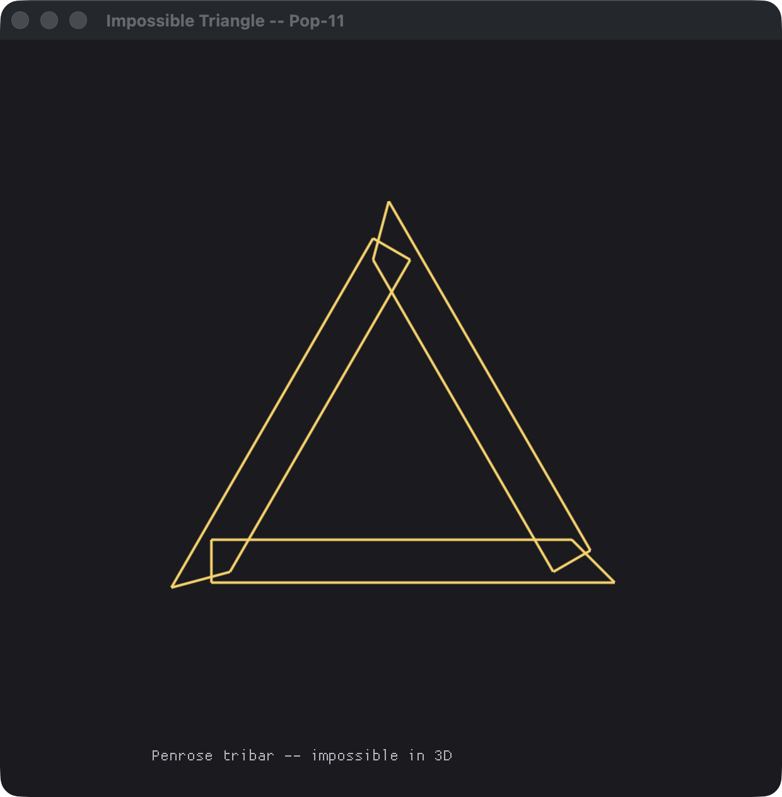
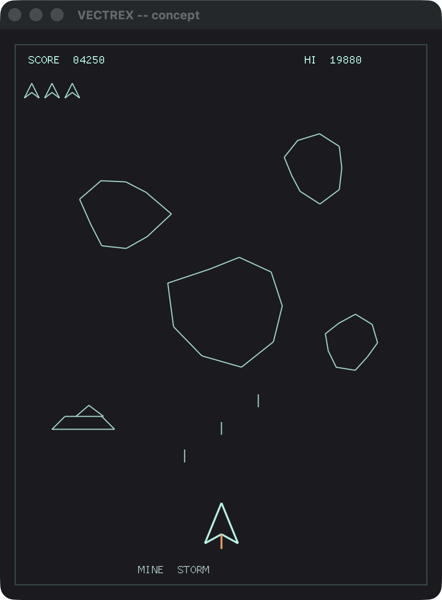

# Examples

Small, self-contained Pop-11 programs.

## Console demos

No graphics build needed — these run on a plain console Poplog.

### `secure_notes.p` — JSON + crypto, composed

A miniature secure-data pipeline using the two libraries added in this fork:
build a structure and serialise it (`lib json`), HMAC-sign it for transport,
verify + parse on the receiving side, seal it at rest under a password-derived
key (PBKDF2 → AES-256-GCM), reopen it, and watch a tampered byte get refused
(`lib crypto`).  Build the shim once with `tools/build-popcrypto.sh`, then:

```sh
./poplog ./target/pop/basepop11 examples/secure_notes.p
```

See `HELP JSON`, `HELP CRYPTO`, and `TEACH JSON` (how these libraries were
built).

### `eliza.p` — ELIZA (Weizenbaum's DOCTOR)

A faithful implementation of Joseph Weizenbaum's 1966 ELIZA — the original
chatbot — using the *real* technology, not the thin teaching pattern-matcher
usually shown for Pop-11: keyword **ranking**, **decomposition** rules with
wildcards and synonym classes, **reassembly** templates cycled round-robin,
pronoun **reflection**, `goto` **equivalence**, and the **MEMORY** mechanism
(it stows what you say about "my …" and brings it back later). The engine is
`eliza.p`; the DOCTOR script is the data file [`doctor.txt`](doctor.txt), read
at startup — Weizenbaum's own script/engine separation. Pop-11's list matcher
makes the decomposition engine a couple of dozen lines.

```sh
./poplog ./target/pop/basepop11 examples/eliza.p     # or:  tools/eliza.sh
```

It reproduces the canonical conversation from Weizenbaum's paper almost
verbatim (your lines are the indented ones):

```
How do you do.  Please tell me your problem.
    Men are all alike.
In what way?
    They are always bugging us about something or other.
Can you think of a specific example?
    Well, my boyfriend made me come here.
Your boyfriend made you come here?
    He says I am depressed much of the time.
I am sorry to hear that you are depressed.
    My mother takes care of me.
Tell me more about your family.
    It is raining today.                  <- no keyword: a stored memory returns
Lets discuss further why your mother takes care of you.
```

Type `bye`, `goodbye`, `quit`, or end-of-file (Ctrl-D) to leave. Swap in a
different script by editing `doctor.txt`.

## Graphics demos

These use the experimental native graphics backend (`uses popgfx` /
`uses rc_graphic`), so they need a Poplog built with
`./configure --experimental-graphics` (Metal on macOS, SDL3 + OpenGL on
Linux; see `BENCHMARKS.md`/`nix` for builds — `nix build .#poplog-gfx`).
Each opens a window that stays up for about a minute, or until you close it.

```sh
./poplog ./target/pop/basepop11 examples/<name>.p
```

| File | What it draws |
| --- | --- |
| `tenprint.p` | The classic [10 PRINT](https://10print.org/) random-diagonal maze (`10 PRINT CHR$(205.5+RND(1)); : GOTO 10`). |
| `cube3d.p` | A spinning 3D wireframe cube, perspective-projected and redrawn each frame. |
| `poplog_letters.p` | The word **POPLOG** in giant block letters — each big letter drawn out of small copies of itself. |
| `impossible_triangle.p` | The Penrose "tribar" impossible triangle, from three rotated beams. |
| `vectrex.p` | A concept "screenshot" for a [Vectrex](https://en.wikipedia.org/wiki/Vectrex)-style vector game (Asteroids/Minestorm): HUD, ship, drifting rocks, shots. |
| `rc_square.p` | Minimal `rc_graphic` turtle demo — a square. |
| `rc_spiral.p` | `rc_graphic` turtle spiral. |

### Gallery

| 10 PRINT | POPLOG (letters of letters) | 3D cube |
| :---: | :---: | :---: |
|  |  |  |
| **Impossible triangle** | **Vectrex concept** | |
|  |  | |
